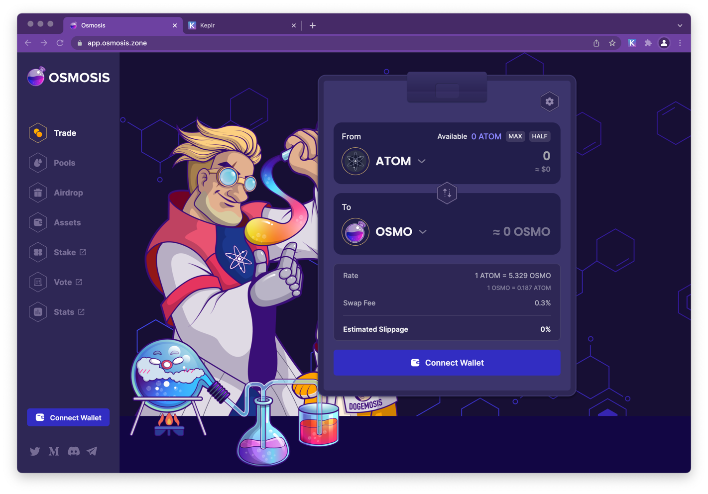
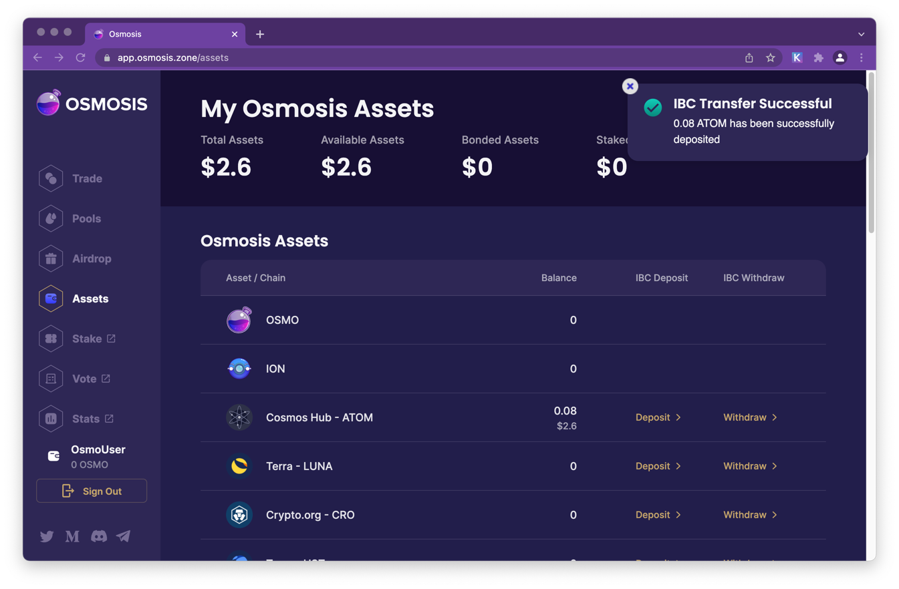
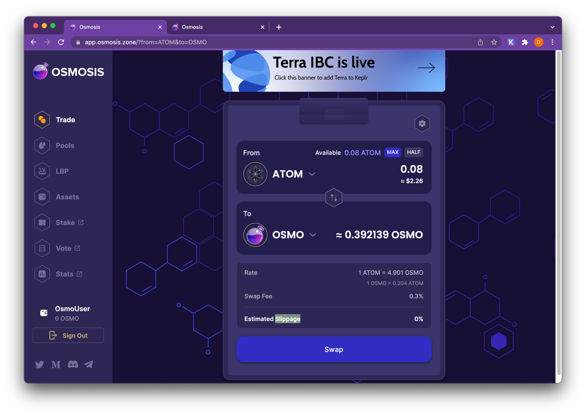
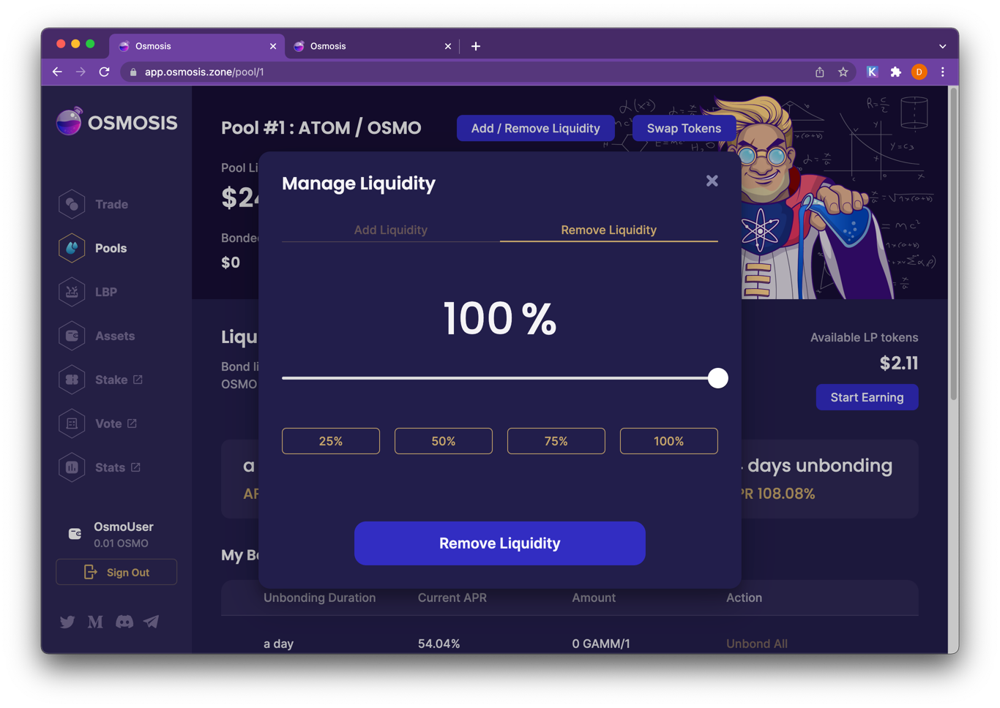
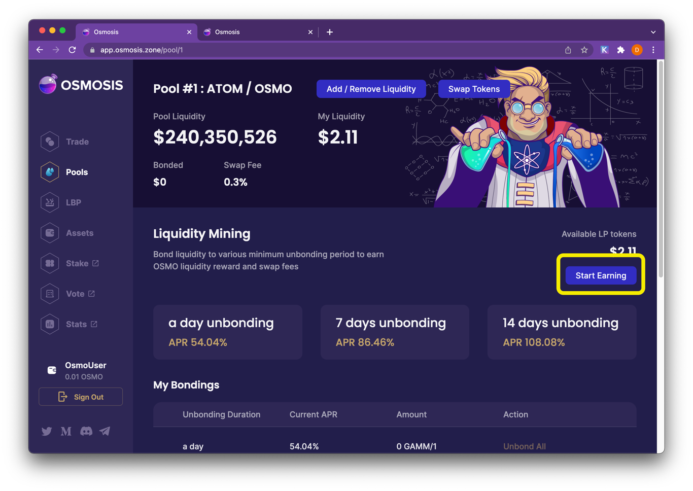
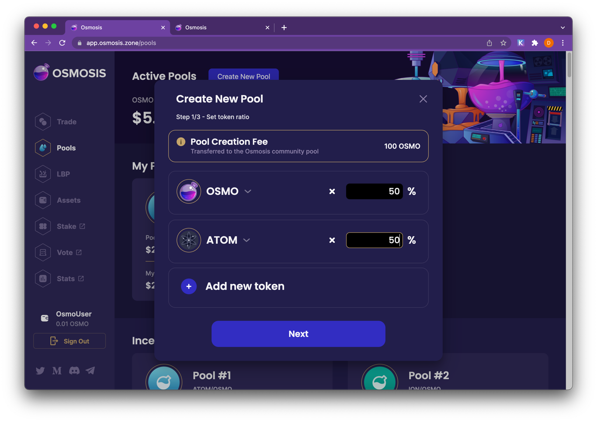
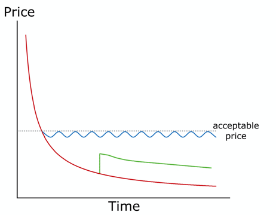
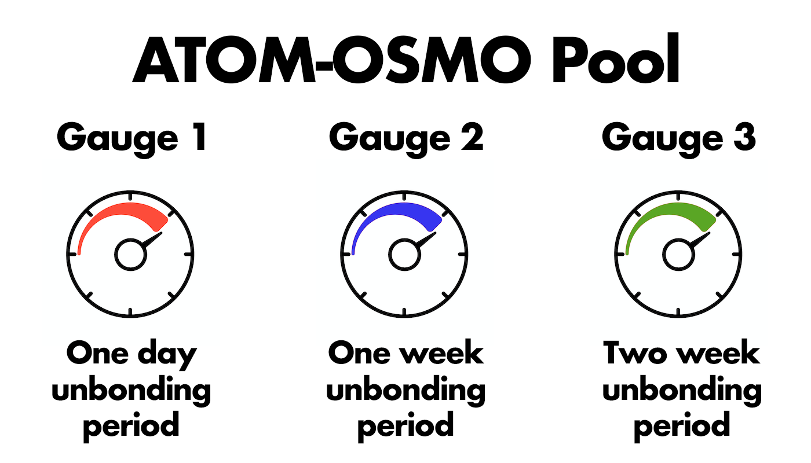

# Getting Started
Before opening the Osmosis AMM App, make sure to install the [Keplr Wallet](../wallets/keplr/README.md).

## Open the App
Go to [https://app.osmosis.zone/](https://app.osmosis.zone/)

## Connect Wallet

Click Approve. This confirms that you are connecting to the app.osmosis.zone and the chain osmosis-1.

::: danger 
Always make sure you are connected to app.osmosis.zone name and network (osmosis-1)
:::

## Deposit Funds

Click Assets. Then click on the deposit link next to the asset name. For this example we are clicking the ATOM deposit link. 

Accept connection to cosmoshub-4

 

Once connected, select how much you would like to deposit, then click the deposit button

Approve the transaction

Once the transaction is completed a series if confirmations notifications will  be displayed including the IBC confirmation.

## Swapping Tokens

Trading tokens is as easy as clicking on the Trade link and then selecting the pair you would like to trade.  Check out the [glossary](../terminology.md) to learn about terms such as [slipage](../terminology.md#slippage). 

# Adding Liquidity to a Pool
Select a pool from the [Pools](https://app.osmosis.zone/pools) page.

Then click Add/Remove Liquidity

Input a quantity of one of the assets. The quantity of the other asset(s) will auto-complete. (Pools require assets to be deposited in pre-determined weights.)

:::warning Warning
Please note that simply adding liquidity will not give you rewards. In order to get rewards you must bond LP tokens. 
:::

To remove liquidity, input the percentage amount to withdraw.

Incentivized pools receive OSMO liquidity mining rewards. Rewards are distributed to bonded LP tokens in these pools that meeting the bonding length criteria.

## Bonding LP Tokens
 Start Earning! Users can choose to bond their LP tokens after depositing liquidity. LP tokens remain bonded for a length of their time of their choosing. Bonded LP tokens are eligible for liquidity mining rewards if they meet the minimum bonding length requirement.

Click Start Earning and choose a bonding length.

When a user wants to stop bonding an LP token, they submit a transaction that begins the unbonding period. After the end of the timer, they can submit another transaction to withdraw the tokens.

## Create a New Pool

Creating pools in Osmosis is permissionless, meaning any user can create a pool with two or more supported assets.
Go to Pools > Create a Pool. Select from your wallet the assets that will comprise the pool. Choose a weight for each asset.

Choose a quantity of each asset to deposit into the pool.

Input a swap fee for the pool. (An explanation of swap fees can be found [here](../terminology.md#fees).)

Click Create a Pool and voilà! The pool is launched. The parameters chosen when creating the pool (token weights, swap fees) cannot be changed later.

 ##  Liquidity Bootstrapping Pools

Osmosis offers a convenient design for Liquidity Bootstrapping Pools (LBPs), a special type of AMM designed for token sales. New protocols can use Osmosis’ LBP feature to distribute tokens and achieve initial price discovery.

LBPs differ from other liquidity pools in terms of the ratio of assets within the pool. In LBPs, the ratio adjusts over time. LBPs involve an initial ratio, a target ratio, and an interval of time over which the ratio adjusts. These weights are customizable before launch. One can create an LBP with an initial ratio of 90-10, with the goal of reaching 50-50 over a month. The ratio continues to gradually adjust until the weights are equal within the pool. Like traditional LPs, the prices of assets within the pool is based on the ratio at the time of trade.

After the LBP period ends or the final ratio is reached, the pool converts into a traditional LP pool.

LBPs facilitate price discovery by demonstrating the acceptable market price of an asset. Ideally, LBPs will have very few buyers at the time of launch. The price slowly declines until traders are willing to step in and buy the asset. Arbitrage maintains this price for the remainder of the LBP. The process is shown by the blue line below. The price declines as the ratios adjust. Buyers step in until the acceptable price is again reached.

Choosing the correct parameters is very important to price discovery for an LBP. If the initial price is too low, the asset will get bought up as soon as the pool is launched. It is also possible that the targeted final price is too high, creating little demand for the asset. The green line above shows this scenario. A buyer places a large order, but afterwards the price continues to decline as no additional buyers are willing to bite.

Osmosis aims to provide an intuitive, easy-to-use LBP design to give protocols the best chance of a successful sale. The LBP feature facilitates initial price discovery for tokens and allows protocols to fairly distribute tokens to project stakeholders.

## Bonded Liquidity Gauges

Bonded Liquidity Gauges are mechanisms for distributing liquidity incentives to LP tokens that have been bonded for a minimum amount of time. 45% of the daily issuance of OSMO goes towards these liquidity incentives.

For instance, a Pool 1 LP share, 1-week gauge would distribute rewards to users who have bonded Pool1 LP tokens for one week or longer. The amount that each user receives is in proportion to the number of their bonded tokens.

A bonded LP position can be eligible for multiple gauges. Qualifications for a gauge only involve a minimum bonding time.

The rewards earned from liquidity mining are not subject to unbonding. Rewards are liquid and transferable immediately. Only the principal bonded shares are subject to the unbonding period.

## Allocation Points

Not all pools have incentivized gauges. In Osmosis, staked OSMO holders choose which pools to incentivize via on-chain governance proposals. To incentivize a pool, governance can assign “allocation points” to specific gauges. At the end of every daily epoch, 45% of the newly released OSMO (the portions designated for liquidity incentives) is distributed proportionally to the allocation points that each gauge has. The percent of the OSMO liquidity rewards that each gauge receives is calculated as its number of points divided by the total number of allocation points.

Take, for example, a scenario in which three gauges are incentivized:

- Gauge #3 – 10 allocation points
- Gauge #4 – 5 allocation points
- Gauge #7 – 5 allocation points

20 total allocation points are assigned in this scenario. At the end of the daily epochs, Gauge #3 will receive 50% (10 out of 20) of the liquidity incentives minted. Gauges #4 and #7 will receive 25% each.

Governance can pass an UpdatePoolIncentives proposal to edit the existing allocation points of any gauge. By setting a gauge’s allocation to zero, it can remove it from the list of incentivized gauges entirely. Proposals can also set the allocation points of new gauges. When a new gauge is added, the total number of allocation points increases, thus diluting all the existing incentivized gauges.
Gauge #0 is a special gauge that sends its incentives directly to the chain community pool. Assigning allocation points to gauge #0 allows governance to save some of the current liquidity mining incentives to be spent at a later time.

At genesis, the only gauge that will be incentivized is Gauge #0, (the community pool gauge). However, a governance proposal can come immediately after launch to choose which gauges/pools to incentivize. Governance voting period at launch is only 3 days at launch, so liquidity incentives may be activated as soon as 3 days after genesis.

## External Incentives

Osmosis not only allows the community to add incentives to gauges. Anyone can deposit tokens into a gauge to be distributed. This feature allows outside parties to augment Osmosis’ own liquidity incentive program.

For example, there may be an ATOM< >FOOCOIN pool that has a one-day gauge incentivized by governance OSMO rewards. However, the Foo Foundation may also choose to add additional incentives to the one-day gauge or even add incentives to a new gauge (such as one-week gauge).

These external incentive providers can also set up long-lasting incentive programs that distribute rewards over an extended time period. For example, the Foo Foundation can deposit 30,000 Foocoins to be distributed over a one-month liquidity program. The program will automatically distribute 1000 Foocoins per day to the gauge.

## Fees

In addition to liquidity mining, Osmosis provides three sources of revenue: transaction fees, swap fees, and exit fees.

### TX Fees
Transaction fees are paid by any user to post a transaction on the chain. The fee amount is determined by the computation and storage costs of the transaction. Minimum gas costs are determined by the proposer of a block in which the transaction is included. This transaction fee is distributed to OSMO stakers on the network.
Validators can choose which assets to accept for fees in the blocks that they propose. This optionality is a unique feature of Osmosis.

### Swap Fees
Swap fees are fees charged for making a swap in an LP pool. The fee is paid by the trader in the form of the input asset. Pool creators specify the swap fee when establishing the pool. The total fee for a particular trade is calculated as percentage of swap size. Fees are added to the pool, effectively resulting in pro-rata distribution to LPs proportional to their share of the total pool.

### Exit Fees
Osmosis LPs pay a small fee when withdrawing from the pool. Similar to swap fees, exit fees per pool are set by the pool creator.
Exit fees are paid in LP tokens. Users withdraw their tokens, minus a percent for the exit fee. These LP shares are burned, resulting in pro-rata distribution to remaining LPs.

